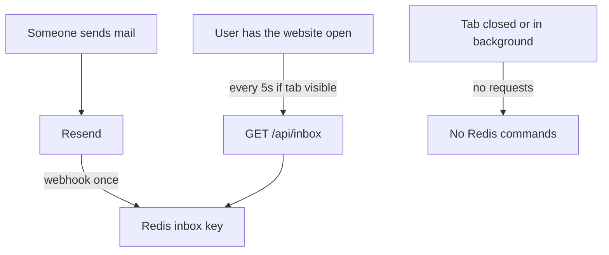
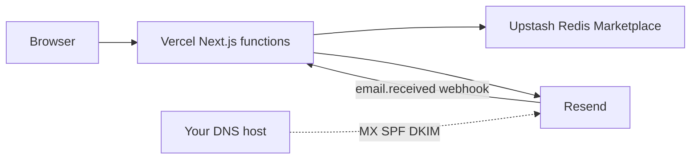
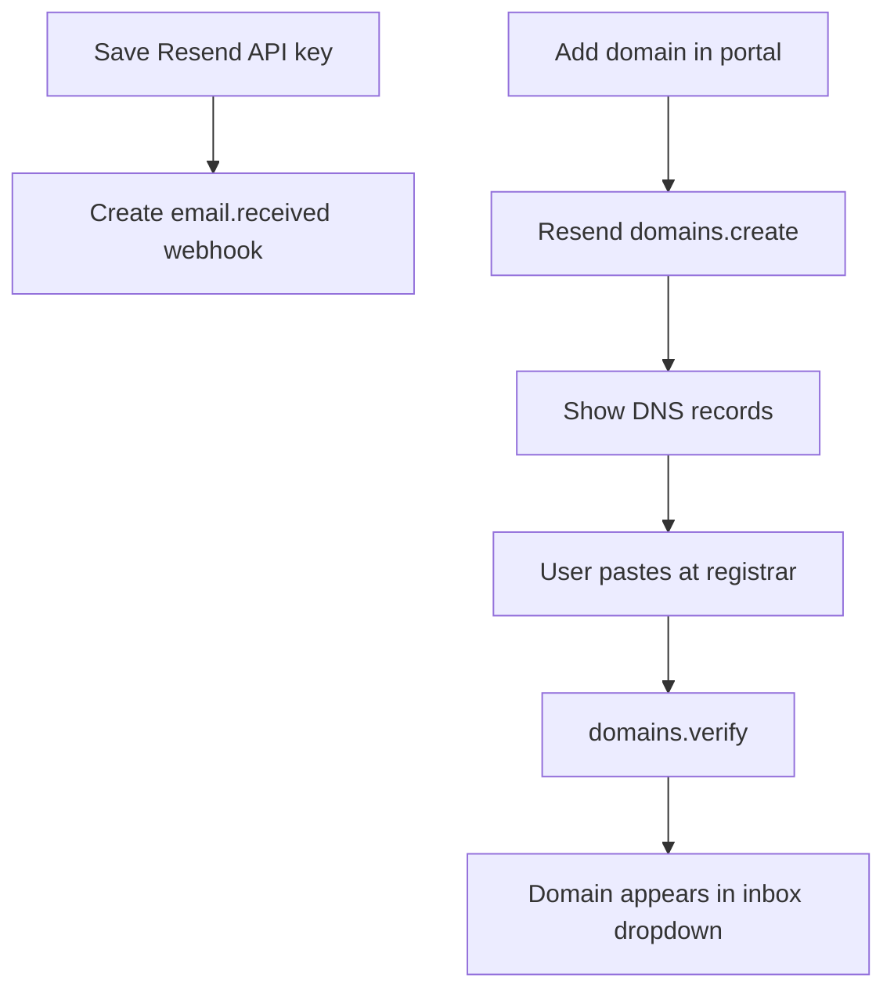
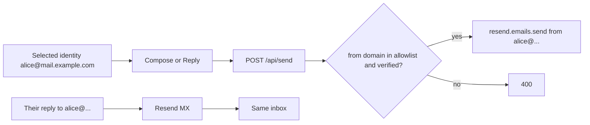

# Serverless temp mail with in-app settings

## Can “only Vercel” be enough?

**Compute: yes. Persistence: no.** Vercel functions are stateless. Inboxes and portal settings must live in a store.

**Operational target (no extra server):**

- **Vercel** — Next.js App Router (UI + all API routes as serverless functions)
- **Upstash Redis via Vercel Marketplace** — Hobby (free) includes Marketplace. One click in the Vercel dashboard; `UPSTASH_REDIS_REST_*` (or `KV_REST_API_*`) is injected. Native **Vercel KV is sunset**; Marketplace Upstash is the current Vercel path.
- **Resend** — send + inbound. Email cannot run on Vercel.

You still paste **DNS at your registrar**. No portal can skip MX/SPF/DKIM; we can only create the domain in Resend and show the records.

## Hobby (Vercel free) — Marketplace is available

Vercel documents Marketplace storage as available on **Hobby, Pro, and Enterprise**. You do not need Pro for Upstash.

**Two equivalent ways to get Redis (same app code):**

- **Marketplace (preferred):** Vercel dashboard → Storage / Marketplace → Upstash Redis. Start on **Free** (256 MB, 10 GB bandwidth, 500K commands). Same product if you later switch the DB to **Pay as you go**.
- **Direct (fallback):** create a DB at [upstash.com](https://upstash.com) and paste `UPSTASH_REDIS_REST_URL` + `UPSTASH_REDIS_REST_TOKEN` into Vercel env.

If Marketplace asks you to sign in to Upstash, that is still free on the Free plan.

**Hobby limits that actually matter here:** function max duration (300s) is plenty for webhook + `receiving.get`. Hobby is for personal/non-commercial use per Vercel’s terms.

README will document both Marketplace and paste-env setup so Hobby users are not blocked.

## How temp mail actually works (no always-on poll)

Real temp-mail sites (10MinuteMail, Guerrilla, temp-mail.org) do **not** poll Redis 24/7. There is no cron and no background worker watching inboxes.

Two different paths:

1. **Mail arrives (always, even if nobody is on the site)** — SMTP → Resend → `POST /api/webhooks/resend` → write Redis. Event-driven. A few commands **per email**, not per second. This is how you still receive a signup code after you close the tab; it just sits in Redis until you open the site again (or until 24h TTL).
2. **Inbox UI refresh (only while you are on the website)** — the **browser** calls `GET /api/inbox` every 5s. Close the tab → JS is gone → **zero polls**. Switch to another tab/app → `document.hidden` → pause. Come back → one fetch, then 5s again.

Typical use: open site → generate address → keep tab visible 2–10 minutes waiting for a verification email → copy code → close tab. Example: 10 min × 12 polls/min = **120 commands per visit**. 50 visits/month ≈ **6K** plus webhooks. **Upstash Free 500K is ample** for this pattern. The 518K “24/7 tab” number is not how temp mail is used; we will not design around it.

**UI rules:**

- **Refresh is always visible** (Copy, Refresh, Delete). That is the control most temp-mail sites lead with; one click = one `GET /api/inbox`.
- **Auto-refresh is a toggle**, not the only way to load mail. Default **on at 5s** while this tab is visible so waiting for an OTP does not mean mashing Refresh. Turn it off to match a fully manual inbox.
- `visibilitychange`: skip ticks while hidden; fetch once when visible again (and on address switch).
- Abort in-flight requests on address switch / unmount.
- No Vercel Cron, no SSE, no server loop over all inboxes.

**Still keep cheap polls (good engineering, not a UX throttle):** one JSON key per inbox, 60s settings cache, Redis rate-limit send only, pipeline webhook writes.

Start on Upstash Free. Upgrade to Pay as you go only if usage actually grows.

## Config model: env defaults, Redis overlay

Resolution order: **Redis `app:settings` wins, then `process.env`.** Env is the bootstrap/default; the portal is how you change production without touching Vercel env again.

Stored in Redis (portal-editable):

- `resendApiKey`
- `resendWebhookSecret` (auto-filled when the app registers the webhook)
- `domains[]` plus Resend domain ids / verification status
- `inboxTtlSeconds`, `maxMessagesPerInbox`
- `appUrl` (webhook endpoint; default `https://$VERCEL_URL`)

Stay in env only (rarely change, or injected):

- Redis URL/token (Marketplace)
- `SETTINGS_SECRET` — gates `/settings` (the one secret you should set in Vercel)
- `MOCK_MODE=1` for local

[`/.env.example`](.env.example) already has Resend/Upstash/DOMAINS/TTL; add `SETTINGS_SECRET` and keep the rest as optional defaults.

**First-run:** if Redis has no settings, env values seed the portal. Save writes Redis. Later edits do not require a redeploy.

## Settings portal (new vs original design)

Protected **`/settings`** (not the public inbox). Auth: signed httpOnly cookie using `SETTINGS_SECRET`. In `MOCK_MODE` with no secret, settings stay unlocked for local use. Production without `SETTINGS_SECRET` refuses to show or save secrets.

Portal fields:

- Resend API key (write-only after save; UI shows last 4)
- App public URL
- TTL / inbox cap
- Domain list with **Add domain**

**On save of API key:** call `resend.webhooks.create({ endpoint: '{appUrl}/api/webhooks/resend', events: ['email.received'] })`, persist `signing_secret` from the create response. User does not paste a webhook secret unless they already created one in Resend.

**Add domain (Resend API, not just a text field):**

1. `resend.domains.create({ name })`
2. `resend.domains.update` with receiving `enabled`
3. Show DNS records from the create/get response (MX/TXT/CNAME) to copy
4. “I’ve added records” → `resend.domains.verify`
5. When status is verified / receiving ready, domain joins the app allowlist used by the address dropdown

DNS remains a human step; the portal does not talk to Cloudflare/Namecheap.

Public inbox stays unauthenticated (anyone who knows an address can read it). Document that. Settings and `/api/settings/*` never are.

## Compose and Reply from `any@your-domain`

**Yes.** Resend does not make you pre-create mailboxes. After a domain is **verified for sending**, `from` can be any local-part: `bob123@mail.example.com`, `verify-x@mail.example.com`, etc. Same address you generated in the UI.

**Not** any address on the internet. `from: someone@gmail.com` is rejected. From must be `@` a domain you added in Settings and verified in Resend (SPF/DKIM). Receiving MX is a separate DNS record; sending still works from the same domain once sending is verified.

**Compose (new mail)**

- From = currently selected disposable address (not typed freely as another domain)
- To / subject / body from the modal
- `replyTo` = same From, so if they hit Reply in Gmail it comes back to this temp inbox
- Rate-limit send; size limits

**Reply (on a received message)**

- To = original From
- Subject = `Re: …` unless it already starts with Re:
- Body quoted (`>` lines) under the new text
- `headers['In-Reply-To']` = stored RFC `Message-ID` of the inbound mail (Resend’s `message_id` on `email.received`)
- `headers.References` = that id (and prior References if present)
- `replyTo` = selected address

**Store:** keep `messageId` (and optional `references`) on `msg:{address}:{id}` so Reply can thread. Do not need to store sent copies.

**Limits (honest):**

- Resend sending quota / daily limits still apply (separate from Upstash).
- Random local-parts can look spammy; SPF/DKIM pass because they are domain-level. A dedicated subdomain (`mail.example.com`) is better than the root domain you use for real mail.
- Mock mode stubs send (no Resend) so Compose/Reply still work locally.
- No attachments on send in v1 (spec did not require them).

Reuse the existing Redis data model and mock mode. Scaffolding already in repo: [`package.json`](package.json), Tailwind v4, Vitest, [`.env.example`](.env.example). No `app/` yet — this is a greenfield implement.

**Store**

- `inbox:{address}` — one JSON list of summaries (1 GET per poll; trim to 50 on write)
- `msg:{address}:{id}` — full body plus `messageId` / `references` for reply threading; read only when opening a message
- TTL default 86400; HTML/text capped at 256 KB
- Same store interface for Redis and in-memory mock

**API**

- `GET /api/config` — public: domains, TTL, mock flag (no secrets)
- `POST /api/webhooks/resend` — Node runtime, raw body, Svix verify, `receiving.get`, store per recipient
- `GET/DELETE /api/inbox`, `GET /api/inbox/[id]`
- `POST /api/send` — `replyTo` + In-Reply-To/References
- `POST /api/dev/seed` — mock only
- `GET/PUT /api/settings`, domain create/verify routes — cookie-gated

**UI**

- Split pane: address switcher (domain dropdown, custom local-part, generate random, localStorage identities) + inbox list | safe HTML preview (DOMPurify, iframe `sandbox=""`, images off by default)
- Compose/Reply modal
- Inbox actions: **Refresh** always; **Auto refresh** toggle (default on, 5s, only while this tab is visible); Copy address; Delete
- Settings page linked from header

**Abuse:** local-part pattern, domain allowlist, reserved names, body size limits, `@upstash/ratelimit` on **send only** (off in mock). Inbox reads are not Redis-rate-limited, to save command quota.

## Files to add (high level)

- `app/layout.tsx`, `app/page.tsx`, `app/globals.css`, `app/settings/page.tsx`, `app/settings/login/page.tsx`
- `app/api/{config,inbox,inbox/[id],send,webhooks/resend,dev/seed,settings,settings/domains}/route.ts`
- `components/{AddressPanel,InboxList,MessageView,HtmlPreview,ComposeModal,SettingsForm,DomainRecords}.tsx`
- `hooks/{useAddresses,useInbox}.ts`
- `lib/{redis,store,resend,settings,auth,domains,sanitize,random,ratelimit,types}.ts`
- `__tests__/` for validation, reply quoting, store contract, webhook normalize, settings overlay
- `README.md` — Marketplace Redis, polling only while the site is open, Settings-first setup, DNS, mock mode

Node for lint/test/build: `/home/kc/.local/share/fnm/node-versions/v22.23.1/installation/bin` (not on PATH).

## What this does not include

No extra Node server, no SSE, no attachment proxy, no end-user accounts, no automatic DNS at the registrar.
